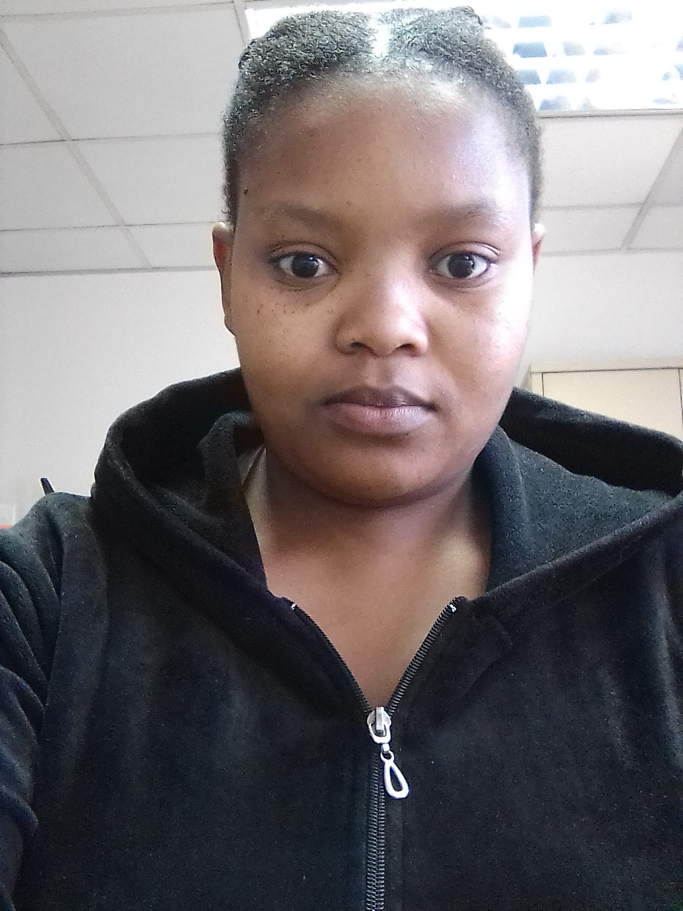

# Hi👋, I am Lerato Makhasane



## About Me
I am a Web Developer that enjoys learning new skills and improving skills I 
have already. I am a member of LearnWeb3DAO learning blockchain development 
it is very interesting and I enjoy learning it. 
I am a member of the EddieHub Community which I am new to, 
learning about open source development and also how to contribute 
to open source. I enjoy exploring tools and techniques to solve a problem, I am a student for life.


```ts
if(fail) {
    console.log("Do not be afraid to fail.'\n'
    Failure is another stepping stone to greatness");
}
else {
    console.log("Do nothing and achieve nothing");
}
```
